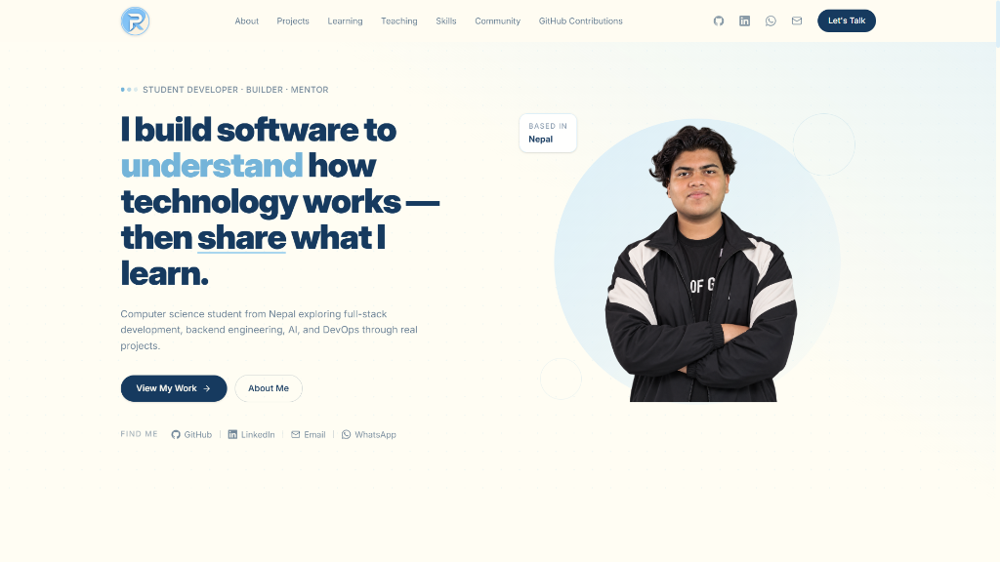

# Rishav Kumar Singh — Personal Portfolio

<p align="center">
  
</p>

<p align="center">
  <strong>Student Developer · Builder · Mentor</strong>
</p>

<p align="center">
  <a href="https://github.com/rishavo01"></a>
  <a href="https://www.linkedin.com/in/rishav-singh-521538369/"></a>
  <a href="https://wa.me/9779809657146"></a>
  <a href="mailto:rishavkumarsingh012@gmail.com"></a>
</p>

---

## ✦ About The Project

A personal portfolio built to showcase real software engineering projects, backend systems, Web3/blockchain explorations, teaching experience, and GitHub contributions.

Designed with an editorial aesthetic using a **Baby Blue + Cream** visual color system.

### Key Sections:
- **Hero & Story**: Narrative focused on learning deeply by building real systems.
- **Projects**: Featured, full-stack, and experimental applications (Pharmacy Platform, CareConnect, Chemical Inventory, Smart Farming Rover).
- **Learning Journey**: Structured 8-step roadmap from HTTP fundamentals to system architecture.
- **Currently Exploring**: Active hands-on learning with Web3 & Blockchain.
- **GitHub Contributions**: Real-time dynamic SVG heatmap powered by public GitHub activity data.
- **Teaching**: Mentorship and community teaching impact at National Ideal Boarding School (NIBS).
- **Skills & Leadership**: Categorized technical proficiencies and hackathon/community involvement (DeerHack, GDG, LOCUS).
- **Timeline & Contact**: Growth journey and direct contact channels (WhatsApp, Email, LinkedIn, GitHub).

---

## 🛠️ Tech Stack

- **Frontend**: React 19, TypeScript
- **Styling**: Tailwind CSS v4 (Custom Design System: Baby Blue `#74B4D9` & Cream `#FFFDF3`)
- **Build Tool**: Vite
- **Icons**: Custom SVG + Lucide React
- **Data Integration**: Dynamic GitHub Contribution API

---

## 🚀 Getting Started

### Prerequisites
- Node.js (v18 or higher recommended)
- npm or yarn

### Installation

```bash
# Clone the repository
git clone https://github.com/rishavo01/portfolio-2026.git

# Navigate into project directory
cd portfolio-2026

# Install dependencies
npm install

# Start local development server
npm run dev
```

### Build for Production

```bash
npm run build
```

---

## 📬 Contact

- **Name**: Rishav Kumar Singh
- **Location**: Nepal
- **Email**: [rishavkumarsingh012@gmail.com](mailto:rishavkumarsingh012@gmail.com)
- **WhatsApp**: [+977 9809657146](https://wa.me/9779809657146)
- **GitHub**: [github.com/rishavo01](https://github.com/rishavo01)
- **LinkedIn**: [linkedin.com/in/rishav-singh-521538369](https://www.linkedin.com/in/rishav-singh-521538369/)

---

<p align="center">
  <sub>© 2026 Rishav Kumar Singh. Built with curiosity and code.</sub>
</p>
